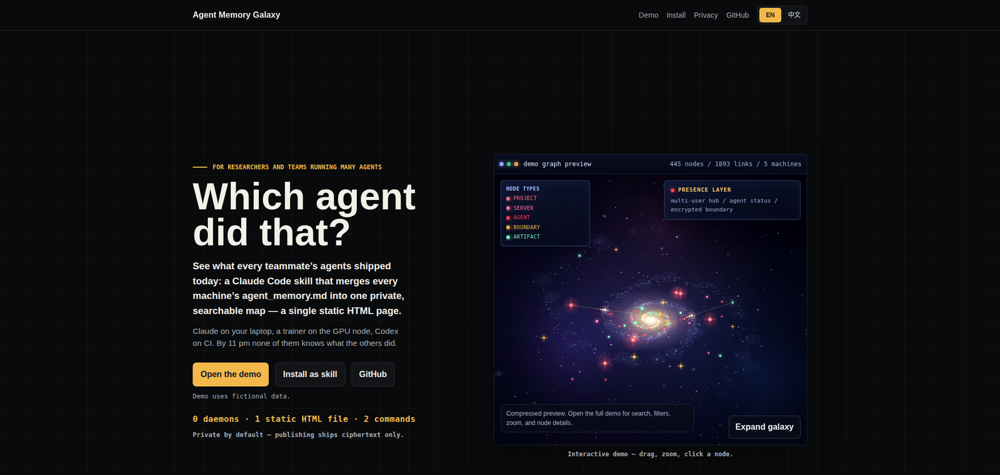
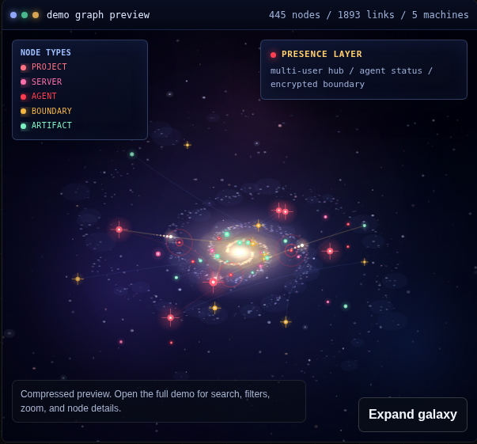
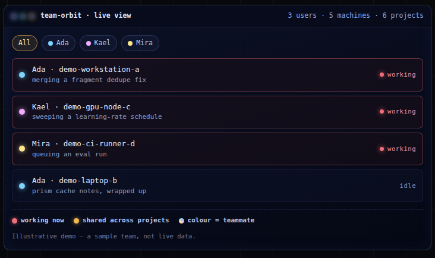

<div align="center">

<h1>🌌 Agent Memory Galaxy</h1>

<p><b><i>昨天是哪个 agent 改的？</i></b><br>
把每台机器、每个工具里 agent 记住的一切，汇成一张私有、可搜索的图。</p>

<p>


</p>

<a href="https://renyunli0116.github.io/agent-memory-galaxy/">
  
</a>

<p>
  <a href="https://renyunli0116.github.io/agent-memory-galaxy/"><b>▶ 打开在线演示 / Open the live demo</b></a>
</p>

<sub><a href="README.md">English</a> · <a href="README.zh-CN.md">中文</a></sub>

</div>

---

Agent Memory Galaxy 会把分散在多台机器、多种 AI agent 工具中的工作痕迹，汇成一个私有、可检查、可搜索的记忆图谱。它是一个 Claude Code skill，加上一小套零依赖的 Python 脚本：采集已审阅的 `agent_memory.md`、可选的安全会话元数据、每台机器的 fragments 和在线 presence，生成一份 `graph.json`，再用静态 Galaxy Viewer 展示——就一个 HTML 页面，不需要服务器，不需要数据库。

这个 public repo 是可复用框架、skill 包和公开演示站点。真实 fragments、明文图谱应放在私有 fork、私有 hub 或本地 checkout。

## 团队为什么选它

- **🪐 全队的记忆，汇成同一张图** —— 每个成员的机器把 fragment 推进同一个私有 hub；可按 user 筛选、着色，看清谁在哪台机器上做了什么。
- **🔒 明文只留在本地或你的私有 hub** —— 只有公开的 Pages 部署才加密：客户端 AES-256-GCM，配合 PBKDF2 与双密码；没有任何联网上报。
- **🧩 兼容你已经在用的编码 agent** —— 今天已原生支持 Claude Code、Codex、Cursor；`agent_memory.md` 是纯 markdown，任何会写它的工具也都能进图。
- **🪶 这层记忆几乎不额外烧 token** —— 图谱由零依赖的 Python 标准库构建：默认启发式，LLM 可选且默认关闭。给 agent 的工作建索引本身不烧 token。
- **🐙 你只需要一个 GitHub 账号** —— 不用服务器、不用数据库、不用注册 SaaS、不用 API key。一个 git 仓库加 Python 标准库即可；协作只需把队友加为 GitHub collaborator 再 push。
- **♻️ 自动刷新，自动点亮在线工作** —— cron 定时重建图谱；auto-presence 自动检测正在工作的 agent 并亮起红色脉冲，无需手动心跳。
- **🛰️ 给负责人的一张实时地图** —— 一眼看清谁在哪台机器、哪个项目：红色代表正在工作，金线代表跨项目引用。

## 看一眼

<div align="center">
<table>
<tr>
<td width="50%" align="center" valign="top">
  <a href="https://renyunli0116.github.io/agent-memory-galaxy/demo/">
    
  </a>
  <br><sub>可交互的 demo 银河 —— 拖拽、缩放、点击节点。</sub>
</td>
<td width="50%" align="center" valign="top">
  <a href="https://renyunli0116.github.io/agent-memory-galaxy/">
    
  </a>
  <br><sub>负责人视角：谁在哪台机器，实时可见。</sub>
</td>
</tr>
</table>
<sub>图中一切均为虚构 demo 数据，真实记忆保持私有。</sub>
</div>

## 快速开始

安装 Claude Code 插件 —— 两条命令，分两条消息运行：

```text
/plugin marketplace add https://github.com/RenyunLi0116/agent-memory-galaxy
```

```text
/plugin install agent-memory-galaxy@agent-memory-galaxy
```

然后用自然语言调用 skill，例如：“Use Agent Memory Galaxy to create a private hub” 或“Use Agent Memory Galaxy to review this repo before public release”。插件安装的是指导流程；运行脚本仍需要 repo checkout。

想先上手试试？在本地重建合成 demo —— 这条路径不会扫描你的机器：

```bash
git clone https://github.com/RenyunLi0116/agent-memory-galaxy.git
cd agent-memory-galaxy
python3 scripts/build-public-demo.py
python3 -m http.server 8765 --directory docs
```

打开 `http://127.0.0.1:8765/` 查看宣传页，打开 `http://127.0.0.1:8765/demo/?style=cosmos&lang=zh` 查看中文交互 demo。

## Team Work 如何拼在一起

一个私有 hub 可以由整个团队共享。图谱中有两个身份概念，必须区分：

- **agent** —— 记忆条目正文里标注的执行者（`claude`、`codex`、`cursor`、`human`），回答「这条工作是哪个工具干的」。
- **user** —— 推送者身份（GitHub 用户名），即「这些机器和记忆属于谁」。

push 权限本身就是成员声明：把队友加为私有 hub 的 GitHub collaborator，他就能用自己的身份贡献。`user` 只作为节点属性存在，绝不进入节点 id，因此不同机器的图谱始终能干净合并。完整步骤见下方「Team Work：一个私有 Hub，多个用户」一节。

## 一句话说清隐私

public repo 只承载框架代码、文档、skill 包和合成 demo 数据；真实的 `fragments/*.json`、`presence/*.json`、`graph.json` 都放在私有 hub，唯一会离开它的，是携带 AES-256-GCM 密文的公开 Pages 部署。完整说明见 [隐私模型](#隐私模型)。

---

## 作为 Claude Code Plugin/Skill 安装

在 Claude Code 中分两条消息运行：

```text
/plugin marketplace add https://github.com/RenyunLi0116/agent-memory-galaxy
```

然后运行：

```text
/plugin install agent-memory-galaxy@agent-memory-galaxy
```

安装后用自然语言调用 skill，例如：“Use Agent Memory Galaxy to create a private hub” 或“Use Agent Memory Galaxy to review this repo before public release”。plugin 安装的是指导流程；运行脚本仍需要 repo checkout。

## 选择一条路径

### A. 公开宣传页与合成 demo

这条路径不会扫描你的机器，只会重建 `docs/demo/` 下的虚构 demo 数据。

```bash
git clone https://github.com/RenyunLi0116/agent-memory-galaxy.git
cd agent-memory-galaxy
python3 scripts/build-public-demo.py
python3 scripts/build-landing-concepts.py
python3 -m http.server 8765 --directory docs
```

打开 `http://127.0.0.1:8765/` 查看宣传页，打开 `http://127.0.0.1:8765/demo/?style=cosmos&lang=zh` 查看中文合成 demo。demo 图谱是虚构、脱敏、可公开发布的。

### B. 单机私有预览

这条路径扫描一个明确指定的项目目录，并生成本地明文 viewer。不要从 `$HOME`、`/` 或整个 workspace 开始。

```bash
git clone https://github.com/RenyunLi0116/agent-memory-galaxy.git
cd agent-memory-galaxy
./scripts/build-private-preview.py --machine laptop-a --tool codex --roots ~/projects/my-app
```

本地打开 `standalone.html`。它包含明文记忆数据，已被 gitignore。

### C. 多机器私有 Hub

真实协作应使用私有仓库或私有 fork。

```bash
git clone https://github.com/RenyunLi0116/agent-memory-galaxy.git my-memory-hub
cd my-memory-hub
git remote set-url origin git@github.com:<your-user-or-org>/<private-hub>.git
```

每台贡献机器在私有 hub checkout 中运行，并传入窄范围项目根目录：

```bash
AMG_PRIVATE_HUB=1 ./contribute.sh workstation-a codex ~/projects/my-app
```

聚合机器运行：

```bash
./update.sh
```

如果你在私有 hub 中明确希望 Git 跟踪 private fragments、presence 或加密 Pages blob，使用：

```bash
AMG_TRACK_PRIVATE=1 ./update.sh
```

Contributors 写入 `fragments/<machine>.json`。聚合端合并 fragments、注入 presence、可选加密 Pages，并重建本地 `standalone.html`。

### Team Work：一个私有 Hub，多个用户

一个私有 hub 可以由整个团队共享。图谱中有两个身份概念，必须区分：

- **agent** —— 记忆条目正文里标注的执行者（`claude`、`codex`、`cursor`、`human`），回答「这条工作是哪个工具干的」。
- **user** —— 推送者身份（GitHub 用户名），即「这些机器和记忆属于谁」。

创建团队 hub：

1. 按上面路径 C 创建私有 hub 仓库。
2. 把每位成员加为私有 hub 的 GitHub collaborator。push 权限即成员声明，不需要额外账号系统。
3. 可选：在 hub 根目录提交 `team.json`（复制 `team.json.example`）：团队名、成员在 viewer 中的显示名/颜色，以及给启用 team 模式之前的旧 fragments 兜底的 `default_user`。

加入团队 hub —— 每位成员在自己的每台 server 上，用自己的 GitHub 身份 clone 并照常贡献：

```bash
git clone git@github.com:<org>/<private-hub>.git && cd <private-hub>
AMG_PRIVATE_HUB=1 ./contribute.sh my-workstation codex ~/projects/my-app        # 身份自动识别
AMG_PRIVATE_HUB=1 ./contribute.sh my-workstation codex ~/projects/my-app ada   # 或显式声明
```

推送者身份的识别优先级：`--user`（`contribute.sh` 可选的第 4 个参数）> `AMG_USER` 环境变量 > `git config user.name` > `$USER`。它只作为 `user` 属性写在 entry/fact/machine/liveagent 节点上，绝不进入节点 id，因此不同机器的图谱始终能干净合并。

汇总端无需新步骤：`./update.sh` 照常合并所有 fragments，对 team 模式之前的旧 fragments 兜底 `default_user`，并生成 `user` 节点及指向其机器的 `owns` 边。图里存在 user 数据时，viewer 会出现 USER 过滤（联动机器下拉）与按用户着色。

## 它做什么

```text
已审阅笔记        安全会话元数据        贡献机器 fragments       在线 presence
agent_memory.md   Claude/Codex/Cursor   fragments/*.json        presence/*.json
        \                  |                    |                     /
         \                 |                    |                    /
          collect.py + distill.py + merge fragments + presence injection
                                      |
                                  graph.json
                                      |
                本地 standalone viewer 或可选加密 Pages viewer
```

核心文件：

- `collect.py` 扫描本地/远端 sources，并归一化为 `graph.json`。
- `distill.py` 从 agent 原生会话元数据中补全结构化事实，不复制原始对话。
- `fragments/*.json` 允许多台机器向同一个私有 hub 贡献。
- `presence/*.json` 让 viewer 显示当前活跃 agent。
- `viewer/index.html` 是运行时 Galaxy Viewer。
- `docs/index.html` 是公开宣传页，支持 `?lang=en` / `?lang=zh`。
- `docs/demo/` 是完全合成的公开 demo，支持中英文 UI 与节点内容。
- `docs/galaxy/` 预留给可选的加密 viewer shell。

## GitHub Pages URL 策略

公开站点地址：

```text
https://renyunli0116.github.io/agent-memory-galaxy/
```

| URL/path | 用途 | 数据策略 |
|---|---|---|
| `/agent-memory-galaxy/` | 公开宣传页 | 没有真实数据 |
| `/agent-memory-galaxy/?lang=zh` | 中文宣传页 | 没有真实数据 |
| `/agent-memory-galaxy/demo/?style=cosmos&lang=zh` | 中文合成交互 demo | 仅虚构图谱 |
| `/agent-memory-galaxy/demo/?style=cosmos&lang=en` | 英文合成交互 demo | 仅虚构图谱 |
| `/agent-memory-galaxy/concepts/` | 设计探索存档 | 公开、次级页面 |
| `/agent-memory-galaxy/galaxy/` | 可选加密 viewer shell | 公开可访问 shell，不含明文图谱 |
| `/agent-memory-galaxy/galaxy/graph.enc.json` | 可选加密图谱 blob | 仅密文 |
| `standalone.html` | 本地明文 viewer | 仅本地，已 gitignore |
| private hub/fork | 真实 fragments、presence、graph | 私有仓库/本地机器 |

启用 Pages：`Settings -> Pages -> Build and deployment -> Source -> GitHub Actions`。仓库中的 `.github/workflows/pages.yml` 会在每次 push 到 `main` 时发布静态 `docs/` 站点。

GitHub Pages 不是访问控制层。`/galaxy/` 是公开 shell；隐私依赖强客户端加密和对明文产物的私有处理。

## 隐私模型

Agent Memory Galaxy 是 privacy-first，不是 privacy-magic。

公开发布规则：

- public repo：框架代码、文档、skill 包、合成 demo 数据。
- private repo/fork：真实 `fragments/*.json`、`presence/*.json`、`graph.json`、`standalone.html`。
- 可选加密 Pages viewer：`docs/galaxy/index.html` 加 `docs/galaxy/graph.enc.json`，绝不发布明文 `graph.json`。

不要把 secrets、credentials、private keys、未经审阅的敏感代码或原始机密对话写进 memory 文件。会话提炼只应抽取结构化元数据，但发布前仍应审阅配置和生成产物。客户端加密能降低暴露，但公开密文仍可被下载并离线攻击。

本公开模板默认忽略真实 fragments、在线 presence 和加密图谱快照。在私有 hub 中若明确希望 Git 同步私有记忆产物，使用：

```bash
AMG_TRACK_PRIVATE=1 ./update.sh
```

## 可选加密 Pages Viewer

在私有 hub 中创建两个强密码文件：

```bash
printf '%s' 'first-strong-passphrase' > .amg_password
printf '%s' 'second-strong-passphrase' > .amg_password2
chmod 600 .amg_password .amg_password2
AMG_TRACK_PRIVATE=1 ./update.sh
```

可发布输出：

```text
docs/galaxy/index.html
docs/galaxy/graph.enc.json
```

不要发布明文 `graph.json`。

## Contributor 与 Aggregator

- Contributor machine：运行 `AMG_PRIVATE_HUB=1 ./contribute.sh <machine> <claude|codex|cursor|human> <project-root> [user]`，写入私有 fragment 并推到私有 hub。
- Aggregator machine：运行 `./update.sh` 或 `./update.sh --pull`，合并 fragments，注入 presence，可选加密 Pages，并重建本地 standalone viewer。

Contributors 不需要加密密码，也不应修改 `docs/galaxy/`。

## 数据模型

节点包括 `project`、`entry`、`fact`、`agent`、`liveagent`、`machine`、`user`、`dataset`、`server`、`model`、`method`、`file`、`wandb`、`tech`、`notion`、`boundary`、`artifact`。

边包括 `in`、`did`、`located`、`uses`、`touches`、`trains`、`tracks`、`syncs`、`explores`、`references`、`depends_on`、`inherits_from`、`exports_to`、`working_on`、`handoff_to`、`owns`、`shared_on`、`cached_on`、`redacts`、`encrypts`、`publishes`、`keeps_private`、`validates`、`serves`、`replicates_to`、`link`、`on`。

共享实体会自动连接跨机器项目。例如两个 agent 触碰同一数据集、文件、模型或 Notion 页面，它们会在图谱中相连。

## 需求

- Python 3.8+：采集、提炼、demo 生成和 artifact 构建。
- Git：多机器同步。
- `cryptography`：只有启用 `encrypt.py` 加密 Pages 发布时才需要。
- 无需前端构建步骤；viewer 是静态 HTML/CSS/JS。

## License

MIT.
